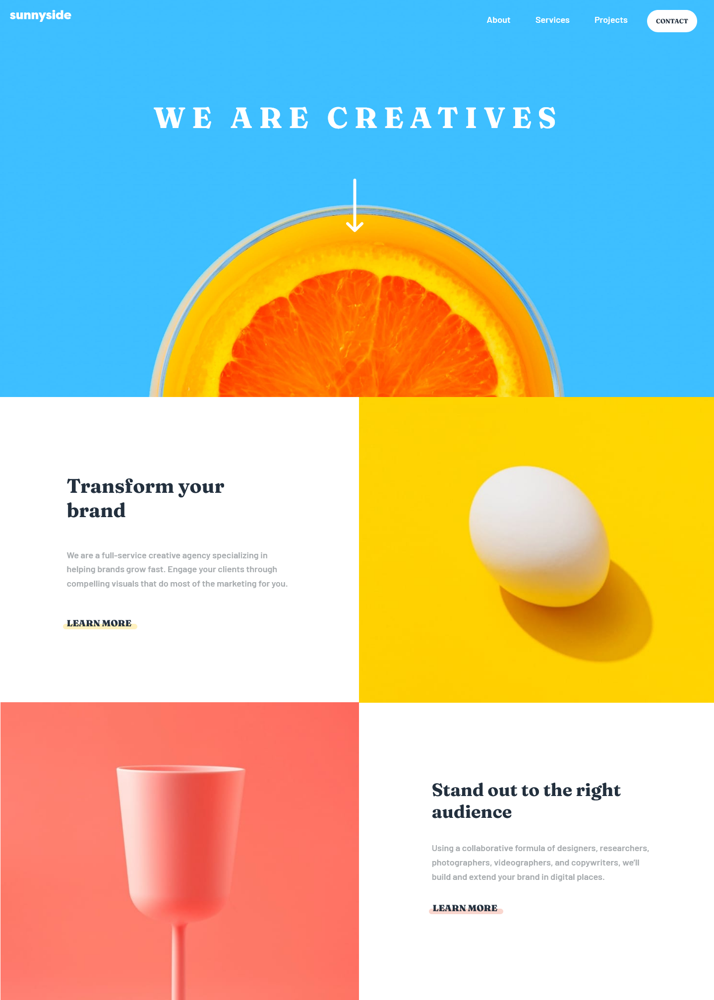
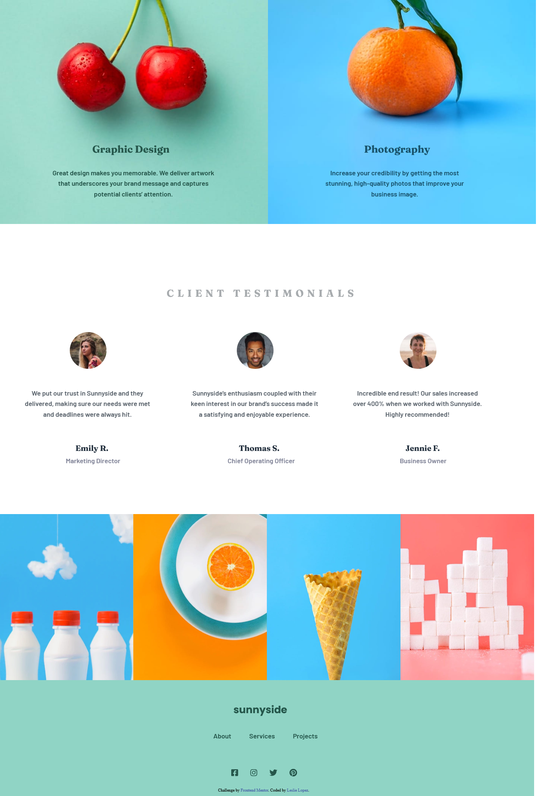
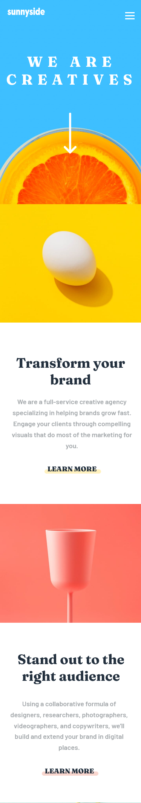
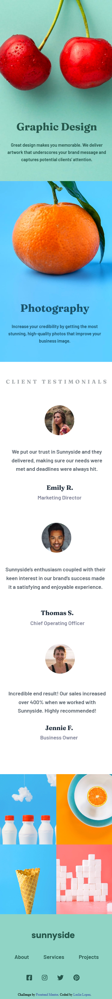

# Frontend Mentor - Sunnyside agency landing page solution

This is a solution to the [Sunnyside agency landing page challenge on Frontend Mentor](https://www.frontendmentor.io/challenges/sunnyside-agency-landing-page-7yVs3B6ef). Frontend Mentor challenges help you improve your coding skills by building realistic projects.

## Table of contents

- [Overview](#overview)
  - [The challenge](#the-challenge)
  - [Links](#links)
- [My process](#my-process)
  - [Built with](#built-with)
  - [What I learned](#what-i-learned)
  - [Continued development](#continued-development)

## Overview

### The challenge

Users should be able to:

- View the optimal layout for the site depending on their device's screen size
- See hover states for all interactive elements on the page

### Screenshots for Desktop (1440px) and Mobile (375px)

 
 

### Links

- Live Site URL: [My Solution](https://leslielopez25.github.io/sunnyside-agency-landing-page-main/)

## My process

### Built with

- Semantic HTML5 markup
- CSS custom properties
- Flexbox
- CSS Grid

### What I learned

Using the position property is very handy in having a lot of control of where you want everything to be positioned in but for me it meant adding in a lot of code in to my css which ended up being 1000+ lines to my css file. Along the way of building this landing page I realized that I need to focus on learning more on flexbox and grid as I saw that it would make it easier to write my code out and have everything positioned right without having to use so much code and when I did try to use flexbox and grid I ended up having trouble understand how to use it. With media queries I had trouble with it just like I did with flexbox and grid but I managed a bit more better. This project was the first time that I've ever did a challenge for and the first time that I didn't follow a tutorial but instead did on my own and had to figure out the issues with the code on myself and see where I need to improve on. This project took longer than I thought, being around 1 month and 11 days, deleted a lot of code and and rewrote a lot more, and had days where I just wanted to pull my hair out but I finally finished it and I'm proud of myself and mt journey to completing this project :grin:

### Continued development

Areas that I will be focusing on are flexbox, grid, and media queries and trying to use the position property a little less since I used it little too much :laughing:

### Updated October 27th, 2021

I've fixed a few issues with the positioning of items in the 1440px screen size and in the 375px screen size.
